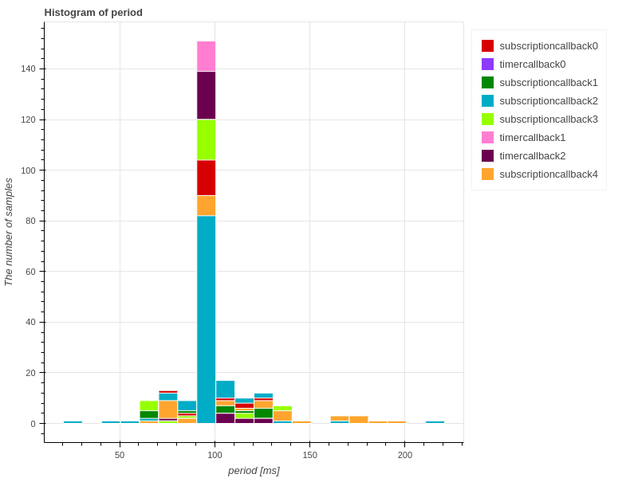
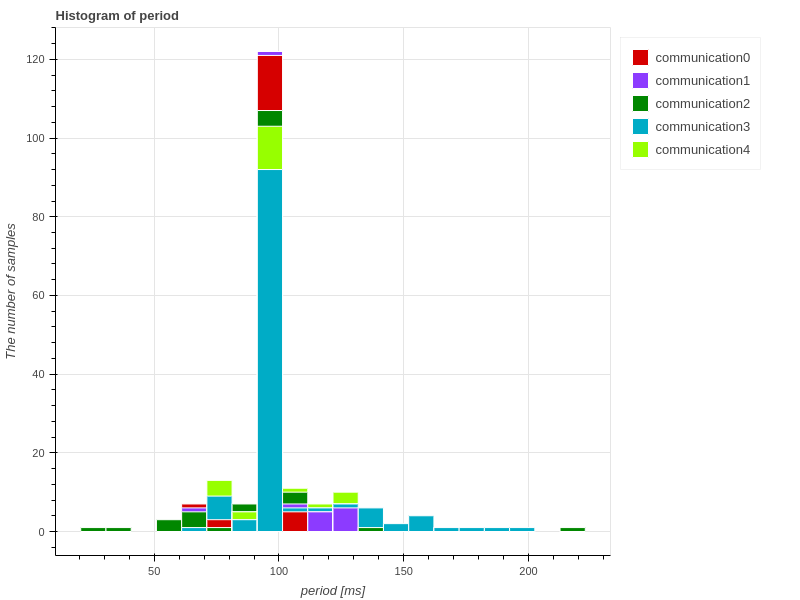

# Period

CARET is capable of showing periods of callback start, message transmission, invocation of publisher or subscription.
`Plot.create_period_timeseries_plot(target_object)` interface is provided for it.
This section describes sample visualization scripts for them.
Execute the following script code to load trace data and an architecture object before calling this method.

```python
from caret_analyze.plot import Plot
from caret_analyze import Application, Architecture, Lttng
from bokeh.plotting import output_notebook, figure, show
output_notebook()
arch = Architecture('yaml', '/path/to/architecture_file')
lttng = Lttng('/path/to/trace_data')
app = Application(arch, lttng)
```

## Callback

`Plot.create_period_timeseries_plot(callbacks: Collections[CallbackBase])` and `Plot.create_period_histogram_plot(callbacks: Collections[CallbackBase])` is introduced to check period between invocation of callback function . Period is more detailed metrics than frequency.

```python
### Timestamp tables
plot = Plot.create_period_timeseries_plot(app.callbacks)
period_df = plot.to_dataframe()
period_df

# ---Output in jupyter-notebook as below---
```


### Timeserise

```python
### Time-series graph
plot = Plot.create_period_timeseries_plot(app.callbacks)
plot.show()

# ---Output in jupyter-notebook as below---
```


The horizontal axis means time, labeled as `Time [s]`. `xaxis_type` argument is prepared to select index of x-axis among Linux system time, [ROS simulation time](../../recording/sim_time.md), and 0-based ordering. One of `'system_time'`, `'sim_time'` and `'index'` is chosen as `xaxis_type` though `'system_time'` is the default value.
The vertical axis means period of callback start, labeled as `Period [ms]`. It is plotted per sample.

### Histogram

```python
### histogram graph
plot = Plot.create_period_histogram_plot(app.callbacks)
plot.show()

# ---Output in jupyter-notebook as below---
```



The horizontal axis means period, labeled as `period [ms]`. The vertical axis is the probability of execution in that time period, labeled `probability`.

## Communication


`Plot.create_period_timeseries_plot(communications: Collection[Communication])` and `Plot.create_period_histogram_plot(communications: Collection[Communication])` is helpful if you want to see that communication period is stable or not.
Here, CARET takes into account communication when both transmission and reception on a message are performed successfully without being lost.
See [Premise of communication](../premise_of_communication.md) for more details.

```python
### Timestamp tables
plot = Plot.create_period_timeseries_plot(app.communications)
period_df = plot.to_dataframe()
period_df

# ---Output in jupyter-notebook as below---
```


### Timeserise

```python
### Time-series graph
plot = Plot.create_period_timeseries_plot(app.communications)
plot.show()

# ---Output in jupyter-notebook as below---
```


The horizontal axis means time, labeled as `Time [s]` while the vertical axis means period, labeled as `Period [ms]`, from communication of a certain message to that of next one. `xaxis_type` argument is provided as well as callback execution.

### Histogram

```python
### Histogram graph
plot = Plot.create_period_histogram_plot(app.communications)
plot.show()

# ---Output in jupyter-notebook as below---
```



The horizontal axis means period, labeled as `period [ms]`. The vertical axis is the probability of execution in that time period, labeled `probability`.

## Publish and Subscription

`Plot.create_period_timeseries_plot(Collection[publish: Publisher or subscription: Subscriber])` is useful to check how stable invocation cycle of publisher or subscription is.

```python
### Timestamp tables
plot = Plot.create_period_timeseries_plot(*app.publishers, *app.subscriptions)
period_df = plot.to_dataframe()
period_df

# ---Output in jupyter-notebook as below---
```


```python
### Time-series graph
plot = Plot.create_period_timeseries_plot(*app.publishers, *app.subscriptions)
plot.show()

# ---Output in jupyter-notebook as below---
```


The horizontal axis means time, labeled as `Time [s]`, while the vertical axis means invocation period of publish or subscription, labeled as `Period [ms]`. `xaxis_type` argument is prepared as well.
